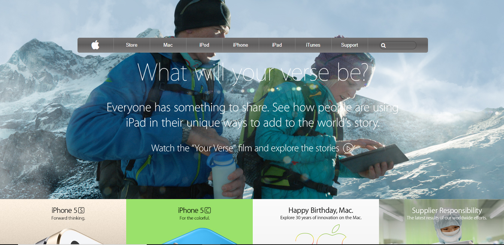

# New York Times Clone Webpage

> This project is a clone of Apple webpage.

The essence of the project is to validate the use of background images and linear gradients to develop a webpage. This webpage contains Header, Main and Footer. The Header Section contains navbar, titles and links. The Main Section is the products part of the webpage where all the product images have laid out. The Footer Section has different links to navigate other pages of the webpage. The Structure of the webpages has been structured by using Grid and Flexbox.

## Built With

- HTML5,
- CSS3,

## Live Demo

[Live Demo Link](https://rawcdn.githack.com/3rkeen/apple-clone/21dacb29178670232f38f16f2db5817797e4f8eb/index.html)

## Getting Started

Click once on the [Live Demo Link](https://rawcdn.githack.com/3rkeen/apple-clone/21dacb29178670232f38f16f2db5817797e4f8eb/index.html)

## Author

👤 **Author**

- GitHub:[@github/3rkeen](https://github.com/3rkeen)
- Twitter:[@twitter/3rkeen](https://twitter.com/3rkeen)
- Linkedin:[linkedin/ErkinSheraliev](https://www.linkedin.com/in/erkin-sheraliev-9122631a0/)

## 🤝 Contributing

Contributions, issues and feature requests are welcome!

Feel free to check the [issues page](https://github.com/3rkeen/apple-clone/issues).

## Show your support

Give a ⭐️ if you like this project!
